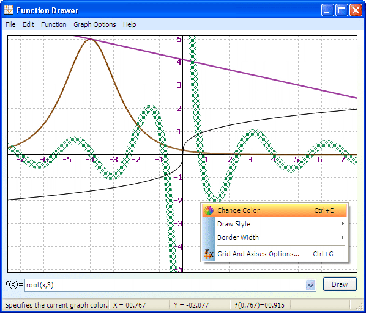

## Function Drawer

### Description

Function Drawer program is for plotting graphs for math functions.                        you can change graph lines styles and colors, draw multiple functions...                        the code includes all common dialogs, each one in class that is easy to use like in .Net, class for menu style changing and menu mouse select event handler, and simple gradient class and other.   Function Drawer has a good look (look the screen shot) and easy to use, some programs have a lot of buttons and text boxes and other controls in one window, which make it hard to use.            For math functions, you can add constants, draw tangents treat with almost all math functions, like trigonometric functions, hyperbolic functions, logarithms, etc.,                               You can also load and save functions to file, and print them.                                       If you don’t know how to use it, press F1 for help.
 
### More Info
 

             |
---                |---
**Submitted On**   |2010-05-14 17:18:52
**By**             |[Saed abumokh](https://github.com/Planet-Source-Code/PSCIndex/blob/master/ByAuthor/saed-abumokh.md)
**Level**          |Advanced
**User Rating**    |4.9 (34 globes from 7 users)
**Compatibility**  |VB 6\.0
**Category**       |[Math/ Dates](https://github.com/Planet-Source-Code/PSCIndex/blob/master/ByCategory/math-dates__1-37.md)
**World**          |[Visual Basic](https://github.com/Planet-Source-Code/PSCIndex/blob/master/ByWorld/visual-basic.md)
**Archive File**   |[Function\_D2181165152010\.zip](https://github.com/Planet-Source-Code/saed-abumokh-function-drawer__1-73156/archive/master.zip)

